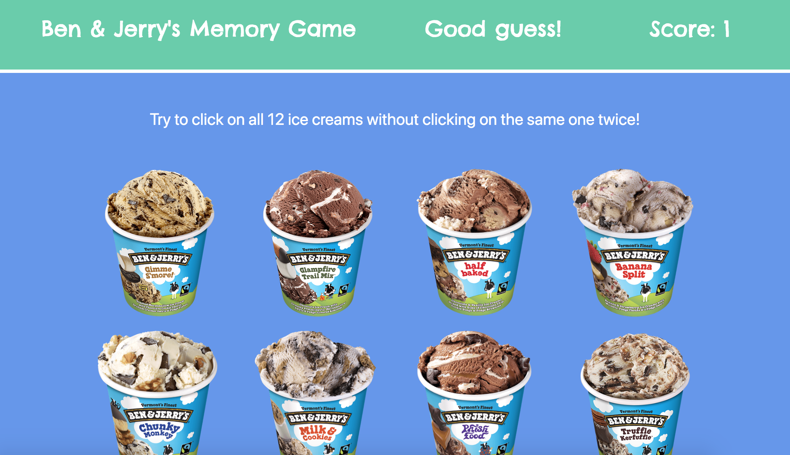

# Ben & Jerry's Memory Game

### About This Project

This project uses React JS to create a memory game. Twelve Ben & Jerry's ice creams are displayed on the page. Players have to try to click all twelve pints without clicking on the same one twice. Each time they click on an ice cream, the photos will shuffle and the player's score will update. The game resets once a player guesses incorrectly or after they click all twelve ice creams.

### How To Play

Visit [this link](https://carmcollins.github.io/clicky-game/) and click any ice cream to begin!

